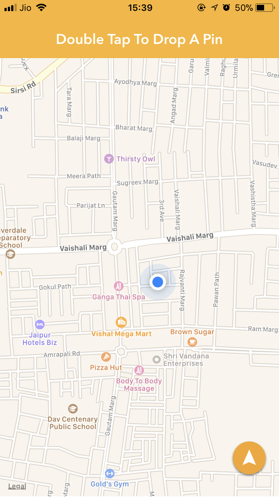
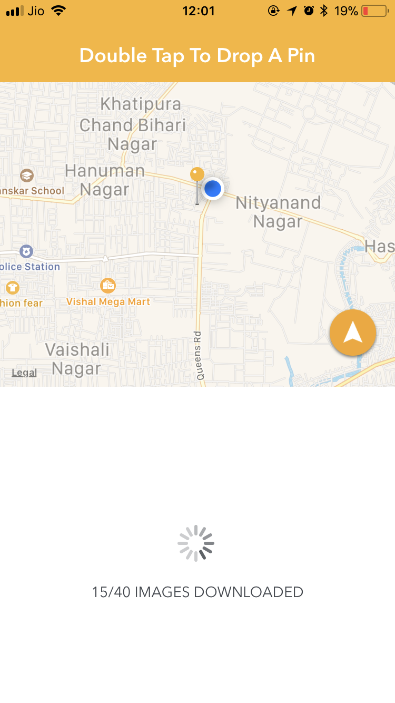
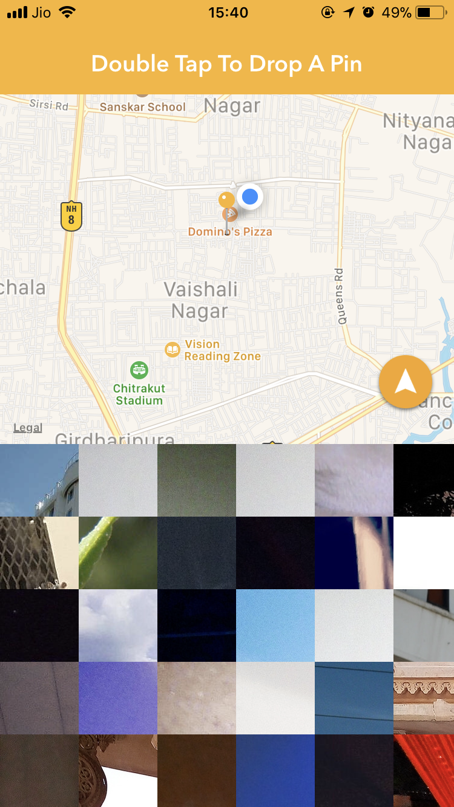
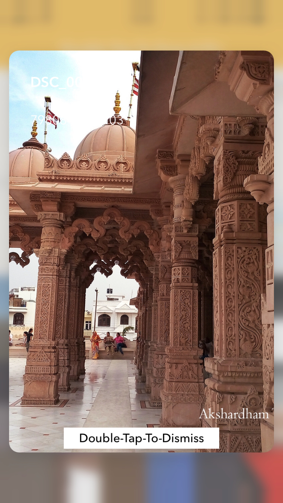

# PixelPoint 
<br>
This app lets you download images of a particular location where you double tap on the map and, it also has a 3d touch feature implemented while pressing the images with different touch pressure<br>

### Pods Used :
```pod 'Alamofire', '~> 4.5'```<br>
```pod 'AlamofireImage', '~> 3.3'```
<br>
### API Used : 
Flickr API
<br>
### Screenshots: 


  
 
